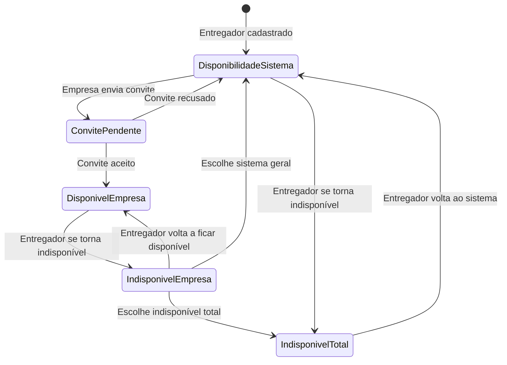

# Design Document - Sistema de Entregadores Fixos

## Overview

O sistema de entregadores fixos permite que empresas estabeleçam vínculos exclusivos com entregadores, criando equipes dedicadas de entrega. O sistema gerencia estados de disponibilidade complexos e prioriza a distribuição de pedidos baseada nesses vínculos.

## Architecture

### Database Schema Extensions

```sql
-- Tabela para gerenciar vínculos empresa-entregador
CREATE TABLE empresa_entregador_fixo (
  id UUID PRIMARY KEY DEFAULT gen_random_uuid(),
  empresa_id UUID REFERENCES empresas(id) ON DELETE CASCADE,
  entregador_id UUID REFERENCES profiles(id) ON DELETE CASCADE,
  status VARCHAR(20) DEFAULT 'pendente' CHECK (status IN ('pendente', 'ativo', 'inativo')),
  data_convite TIMESTAMP WITH TIME ZONE DEFAULT NOW(),
  data_resposta TIMESTAMP WITH TIME ZONE,
  data_vinculo TIMESTAMP WITH TIME ZONE,
  created_at TIMESTAMP WITH TIME ZONE DEFAULT NOW(),
  updated_at TIMESTAMP WITH TIME ZONE DEFAULT NOW(),
  UNIQUE(empresa_id, entregador_id)
);

-- Extensão da tabela profiles para status de disponibilidade
ALTER TABLE profiles ADD COLUMN IF NOT EXISTS status_disponibilidade VARCHAR(30) DEFAULT 'disponivel_sistema' 
CHECK (status_disponibilidade IN ('disponivel_sistema', 'disponivel_empresa', 'indisponivel_empresa', 'indisponivel_total'));

-- Tabela para histórico de mudanças de status
CREATE TABLE entregador_status_historico (
  id UUID PRIMARY KEY DEFAULT gen_random_uuid(),
  entregador_id UUID REFERENCES profiles(id) ON DELETE CASCADE,
  status_anterior VARCHAR(30),
  status_novo VARCHAR(30),
  motivo TEXT,
  empresa_id UUID REFERENCES empresas(id),
  created_at TIMESTAMP WITH TIME ZONE DEFAULT NOW()
);
```

### Status Flow Diagram



## Components and Interfaces

### 1. Painel da Empresa - Gerenciamento de Entregadores Fixos

**Localização:** `src/app/(dashboard)/empresa/entregadores-fixos/page.tsx`

**Funcionalidades:**
- Lista de entregadores fixos atuais
- Botão "Adicionar Entregador Fixo"
- Modal de seleção de entregadores disponíveis
- Status em tempo real dos entregadores
- Histórico de entregas por entregador
- Opção de desvincular entregador

### 2. Modal de Convite de Entregador

**Localização:** `src/components/empresa/convite-entregador-modal.tsx`

**Props:**
```typescript
interface ConviteEntregadorModalProps {
  isOpen: boolean;
  onClose: () => void;
  empresaId: string;
  onConviteEnviado: () => void;
}
```
###
 3. Painel do Entregador - Gerenciamento de Status

**Localização:** `src/app/(dashboard)/entregador/status-disponibilidade/page.tsx`

**Funcionalidades:**
- Visualização de convites pendentes
- Controles de status de disponibilidade
- Informações da empresa vinculada (se houver)
- Histórico de mudanças de status

### 4. Componente de Status de Disponibilidade

**Localização:** `src/components/entregador/status-disponibilidade.tsx`

**Props:**
```typescript
interface StatusDisponibilidadeProps {
  entregadorId: string;
  statusAtual: 'disponivel_sistema' | 'disponivel_empresa' | 'indisponivel_empresa' | 'indisponivel_total';
  empresaVinculada?: {
    id: string;
    nome: string;
  };
  onStatusChange: (novoStatus: string) => void;
}
```

### 5. Sistema de Notificações

**Localização:** `src/components/notifications/convite-notification.tsx`

**Funcionalidades:**
- Notificação de convite recebido
- Notificação de resposta ao convite
- Notificação de mudança de status

## Data Models

### Empresa Entregador Fixo Model

```typescript
interface EmpresaEntregadorFixo {
  id: string;
  empresaId: string;
  entregadorId: string;
  status: 'pendente' | 'ativo' | 'inativo';
  dataConvite: string;
  dataResposta?: string;
  dataVinculo?: string;
  createdAt: string;
  updatedAt: string;
}
```

### Status Disponibilidade Model

```typescript
type StatusDisponibilidade = 
  | 'disponivel_sistema'     // Disponível para todas as empresas
  | 'disponivel_empresa'     // Disponível apenas para empresa vinculada
  | 'indisponivel_empresa'   // Indisponível para empresa, pode escolher sistema
  | 'indisponivel_total';    // Indisponível para tudo

interface EntregadorStatus {
  entregadorId: string;
  statusDisponibilidade: StatusDisponibilidade;
  empresaVinculadaId?: string;
  ultimaAtualizacao: string;
}
```

### Histórico Status Model

```typescript
interface EntregadorStatusHistorico {
  id: string;
  entregadorId: string;
  statusAnterior: StatusDisponibilidade;
  statusNovo: StatusDisponibilidade;
  motivo?: string;
  empresaId?: string;
  createdAt: string;
}
```## AP
I Endpoints

### Empresa Endpoints

```typescript
// GET /api/empresa/entregadores-fixos
// Lista entregadores fixos da empresa
interface ListaEntregadoresFixosResponse {
  entregadores: Array<{
    id: string;
    nome: string;
    email: string;
    telefone: string;
    status: StatusDisponibilidade;
    dataVinculo: string;
    totalEntregas: number;
    avaliacaoMedia: number;
  }>;
}

// POST /api/empresa/entregadores-fixos/convite
// Envia convite para entregador
interface EnviarConviteRequest {
  entregadorId: string;
  mensagem?: string;
}

// GET /api/empresa/entregadores-disponiveis
// Lista entregadores disponíveis para convite
interface EntregadoresDisponiveisResponse {
  entregadores: Array<{
    id: string;
    nome: string;
    avaliacaoMedia: number;
    totalEntregas: number;
    distanciaKm: number;
  }>;
}

// DELETE /api/empresa/entregadores-fixos/[id]
// Desvincula entregador fixo
```

### Entregador Endpoints

```typescript
// GET /api/entregador/convites
// Lista convites pendentes
interface ConvitesPendentesResponse {
  convites: Array<{
    id: string;
    empresa: {
      id: string;
      nome: string;
      endereco: string;
      avaliacaoMedia: number;
    };
    dataConvite: string;
    mensagem?: string;
  }>;
}

// POST /api/entregador/convites/[id]/resposta
// Responde ao convite
interface RespostaConviteRequest {
  aceitar: boolean;
  motivo?: string;
}

// PUT /api/entregador/status-disponibilidade
// Atualiza status de disponibilidade
interface AtualizarStatusRequest {
  novoStatus: StatusDisponibilidade;
  motivo?: string;
}

// GET /api/entregador/status-atual
// Obtém status atual do entregador
interface StatusAtualResponse {
  status: StatusDisponibilidade;
  empresaVinculada?: {
    id: string;
    nome: string;
  };
  podeAlterarPara: StatusDisponibilidade[];
}
```

## Error Handling

### Validation Rules

1. **Convite Duplicado:** Empresa não pode enviar convite para entregador já vinculado
2. **Status Inválido:** Transições de status devem seguir o fluxo definido
3. **Entregador Ocupado:** Não permitir convites para entregadores em entrega ativa
4. **Limite de Vínculos:** Entregador pode ter apenas um vínculo ativo por vez

### Error Messages

```typescript
const ERROR_MESSAGES = {
  CONVITE_DUPLICADO: 'Este entregador já possui vínculo com sua empresa',
  ENTREGADOR_OCUPADO: 'Entregador está realizando uma entrega no momento',
  TRANSICAO_INVALIDA: 'Mudança de status não permitida',
  VINCULO_NAO_ENCONTRADO: 'Vínculo não encontrado',
  PERMISSAO_NEGADA: 'Você não tem permissão para esta ação'
};
```

## Testing Strategy

### Unit Tests

1. **Modelos de Dados**
   - Validação de status transitions
   - Regras de negócio para vínculos
   - Formatação de dados

2. **API Endpoints**
   - Validação de entrada
   - Autorização por role
   - Respostas de erro

3. **Componentes React**
   - Renderização condicional baseada em status
   - Interações do usuário
   - Estados de loading/error

### Integration Tests

1. **Fluxo Completo de Convite**
   - Empresa envia convite → Entregador recebe → Aceita/Recusa
   - Verificação de notificações
   - Atualização de status em tempo real

2. **Sistema de Distribuição de Pedidos**
   - Priorização de entregadores fixos
   - Fallback para pool geral
   - Respeito aos status de disponibilidade

### E2E Tests

1. **Cenário Empresa**
   - Login como empresa → Acessar painel → Convidar entregador → Gerenciar vínculos

2. **Cenário Entregador**
   - Login como entregador → Ver convites → Aceitar → Gerenciar status

3. **Cenário Integrado**
   - Fluxo completo desde convite até entrega com entregador fixo