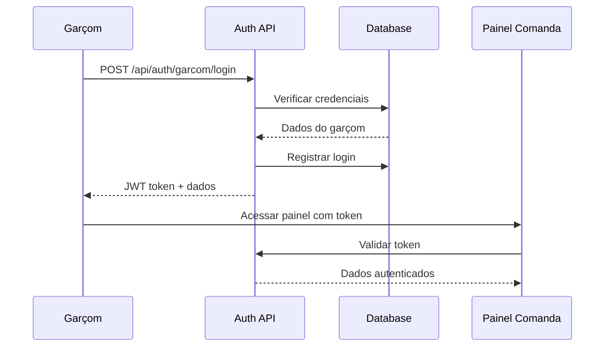

# Design Document - Sistema de Comanda Local

## Overview

O sistema de comanda local permite que empresas (restaurantes) cadastrem garçons com credenciais próprias para criar e gerenciar pedidos presenciais. O sistema integra-se ao painel existente da empresa, adicionando uma camada de atendimento local com controle de acesso e permissões.

## Architecture

### Database Schema Extensions

```sql
-- Tabela para garçons da empresa
CREATE TABLE garcons (
  id UUID PRIMARY KEY DEFAULT gen_random_uuid(),
  empresa_id UUID REFERENCES empresas(id) ON DELETE CASCADE,
  nome VARCHAR(100) NOT NULL,
  usuario VARCHAR(50) UNIQUE NOT NULL,
  senha_hash VARCHAR(255) NOT NULL,
  ativo BOOLEAN DEFAULT true,
  permissoes JSONB DEFAULT '{"criar_pedidos": true, "editar_pedidos": true, "cancelar_pedidos": false}',
  ultimo_login TIMESTAMP WITH TIME ZONE,
  created_at TIMESTAMP WITH TIME ZONE DEFAULT NOW(),
  updated_at TIMESTAMP WITH TIME ZONE DEFAULT NOW()
);

-- Extensão da tabela pedidos para incluir informações locais
ALTER TABLE pedidos ADD COLUMN IF NOT EXISTS tipo_pedido VARCHAR(20) DEFAULT 'delivery' 
CHECK (tipo_pedido IN ('delivery', 'local'));
ALTER TABLE pedidos ADD COLUMN IF NOT EXISTS garcom_id UUID REFERENCES garcons(id);
ALTER TABLE pedidos ADD COLUMN IF NOT EXISTS mesa VARCHAR(20);
ALTER TABLE pedidos ADD COLUMN IF NOT EXISTS observacoes_garcom TEXT;

-- Tabela para logs de atividade dos garçons
CREATE TABLE garcon_atividades (
  id UUID PRIMARY KEY DEFAULT gen_random_uuid(),
  garcom_id UUID REFERENCES garcons(id) ON DELETE CASCADE,
  acao VARCHAR(50) NOT NULL, -- 'login', 'logout', 'criar_pedido', 'editar_pedido', 'cancelar_pedido'
  detalhes JSONB,
  pedido_id UUID REFERENCES pedidos(id),
  ip_address INET,
  user_agent TEXT,
  created_at TIMESTAMP WITH TIME ZONE DEFAULT NOW()
);

-- Índices para otimização
CREATE INDEX idx_garcons_empresa_ativo ON garcons(empresa_id, ativo);
CREATE INDEX idx_pedidos_garcom ON pedidos(garcom_id);
CREATE INDEX idx_garcon_atividades_garcom_data ON garcon_atividades(garcom_id, created_at);
```

### Authentication Flow



## Components and Interfaces

### 1. Painel da Empresa - Gerenciamento de Garçons

**Localização:** `src/app/(dashboard)/empresa/garcons/page.tsx`

**Funcionalidades:**
- Lista de garçons cadastrados com status (ativo/inativo)
- Botão "Adicionar Garçom" 
- Edição de permissões por garçom
- Visualização de última atividade
- Relatórios de performance por garçom

### 2. Modal de Cadastro/Edição de Garçom

**Localização:** `src/components/empresa/garcom-form-modal.tsx`

**Props:**
```typescript
interface GarcomFormModalProps {
  isOpen: boolean;
  onClose: () => void;
  garcom?: Garcom | null; // null para novo, objeto para edição
  onSave: (garcom: GarcomFormData) => void;
}

interface GarcomFormData {
  nome: string;
  usuario: string;
  senha?: string; // opcional na edição
  permissoes: {
    criar_pedidos: boolean;
    editar_pedidos: boolean;
    cancelar_pedidos: boolean;
  };
}
```

### 3. Tela de Login do Garçom

**Localização:** `src/app/comanda/login/page.tsx`

**Funcionalidades:**
- Formulário de login específico para garçons
- Validação de credenciais
- Redirecionamento para painel de comanda
- Mensagens de erro personalizadas

### 4. Painel de Comanda do Garçom

**Localização:** `src/app/comanda/dashboard/page.tsx`

**Funcionalidades:**
- Visão geral dos pedidos do garçom
- Botão "Novo Pedido"
- Lista de pedidos ativos com status
- Notificações de pedidos prontos

### 5. Componente de Criação de Pedido Local

**Localização:** `src/components/comanda/novo-pedido-local.tsx`

**Props:**
```typescript
interface NovoPedidoLocalProps {
  empresaId: string;
  garcomId: string;
  produtos: Produto[];
  onPedidoCriado: (pedido: Pedido) => void;
}

interface PedidoLocalData {
  produtos: Array<{
    produto_id: string;
    quantidade: number;
    observacoes?: string;
  }>;
  mesa: string;
  cliente_nome?: string;
  observacoes_garcom?: string;
}
```## 
Data Models

### Garçom Model

```typescript
interface Garcom {
  id: string;
  empresaId: string;
  nome: string;
  usuario: string;
  ativo: boolean;
  permissoes: {
    criar_pedidos: boolean;
    editar_pedidos: boolean;
    cancelar_pedidos: boolean;
  };
  ultimoLogin?: string;
  createdAt: string;
  updatedAt: string;
}
```

### Pedido Local Model (extensão do Pedido existente)

```typescript
interface PedidoLocal extends Pedido {
  tipoPedido: 'local';
  garcomId: string;
  mesa: string;
  observacoesGarcom?: string;
  garcom?: {
    id: string;
    nome: string;
  };
}
```

### Atividade Garçom Model

```typescript
interface GarcomAtividade {
  id: string;
  garcomId: string;
  acao: 'login' | 'logout' | 'criar_pedido' | 'editar_pedido' | 'cancelar_pedido';
  detalhes?: Record<string, any>;
  pedidoId?: string;
  ipAddress?: string;
  userAgent?: string;
  createdAt: string;
}
```

## API Endpoints

### Autenticação de Garçom

```typescript
// POST /api/auth/garcom/login
interface LoginGarcomRequest {
  usuario: string;
  senha: string;
}

interface LoginGarcomResponse {
  token: string;
  garcom: {
    id: string;
    nome: string;
    usuario: string;
    empresa: {
      id: string;
      nome: string;
    };
    permissoes: GarcomPermissoes;
  };
}

// POST /api/auth/garcom/logout
// Registra logout e invalida token

// GET /api/auth/garcom/me
// Retorna dados do garçom autenticado
```

### Gerenciamento de Garçons (Empresa)

```typescript
// GET /api/empresa/garcons
interface ListaGarconsResponse {
  garcons: Array<{
    id: string;
    nome: string;
    usuario: string;
    ativo: boolean;
    ultimoLogin?: string;
    totalPedidosHoje: number;
    vendaTotal: number;
  }>;
}

// POST /api/empresa/garcons
interface CriarGarcomRequest {
  nome: string;
  usuario: string;
  senha: string;
  permissoes: GarcomPermissoes;
}

// PUT /api/empresa/garcons/[id]
interface AtualizarGarcomRequest {
  nome?: string;
  usuario?: string;
  senha?: string;
  ativo?: boolean;
  permissoes?: GarcomPermissoes;
}

// DELETE /api/empresa/garcons/[id]
// Desativa garçom (soft delete)
```

### Pedidos Locais

```typescript
// POST /api/comanda/pedidos
interface CriarPedidoLocalRequest {
  produtos: Array<{
    produto_id: string;
    quantidade: number;
    observacoes?: string;
  }>;
  mesa: string;
  cliente_nome?: string;
  observacoes_garcom?: string;
}

// GET /api/comanda/pedidos
// Lista pedidos do garçom autenticado

// PUT /api/comanda/pedidos/[id]
interface AtualizarPedidoLocalRequest {
  observacoes_garcom?: string;
  status?: 'cancelado';
}

// GET /api/comanda/produtos
// Lista produtos disponíveis da empresa do garçom
```

## Security Considerations

### Autenticação e Autorização

1. **JWT Tokens:** Tokens específicos para garçons com escopo limitado
2. **Permissões Granulares:** Controle fino sobre ações permitidas
3. **Session Management:** Timeout automático por inatividade
4. **Rate Limiting:** Proteção contra ataques de força bruta

### Validações

```typescript
const GARCOM_VALIDATIONS = {
  usuario: {
    minLength: 3,
    maxLength: 50,
    pattern: /^[a-zA-Z0-9_]+$/, // apenas alfanumérico e underscore
    unique: true // por empresa
  },
  senha: {
    minLength: 6,
    requireNumbers: true,
    requireLetters: true
  },
  nome: {
    minLength: 2,
    maxLength: 100
  }
};
```

## Error Handling

### Códigos de Erro Específicos

```typescript
const GARCOM_ERRORS = {
  CREDENCIAIS_INVALIDAS: 'Usuário ou senha incorretos',
  GARCOM_INATIVO: 'Garçom desativado. Contate o gerente',
  USUARIO_JA_EXISTE: 'Nome de usuário já está em uso',
  PERMISSAO_NEGADA: 'Você não tem permissão para esta ação',
  SESSAO_EXPIRADA: 'Sessão expirada. Faça login novamente',
  EMPRESA_INATIVA: 'Empresa temporariamente indisponível'
};
```

## Testing Strategy

### Unit Tests

1. **Autenticação de Garçom**
   - Validação de credenciais
   - Geração e validação de tokens
   - Controle de permissões

2. **CRUD de Garçons**
   - Criação com validações
   - Atualização de dados e permissões
   - Soft delete e reativação

3. **Criação de Pedidos Locais**
   - Validação de produtos
   - Cálculo de totais
   - Integração com sistema existente

### Integration Tests

1. **Fluxo Completo de Garçom**
   - Cadastro → Login → Criar pedido → Logout

2. **Integração com Sistema de Pedidos**
   - Pedidos locais aparecem no painel da empresa
   - Notificações para cozinha
   - Sincronização de status

### E2E Tests

1. **Cenário Empresa**
   - Cadastrar garçom → Definir permissões → Monitorar atividade

2. **Cenário Garçom**
   - Login → Criar pedido local → Acompanhar status → Logout

3. **Cenário Integrado**
   - Pedido local criado → Processado na cozinha → Cliente atendido